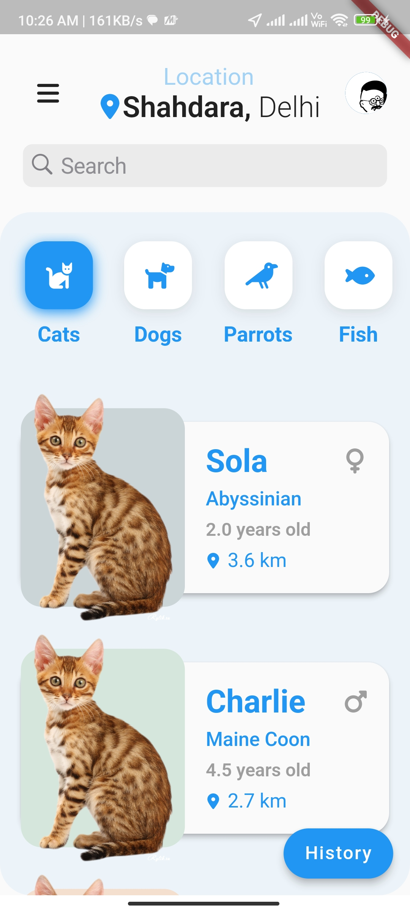
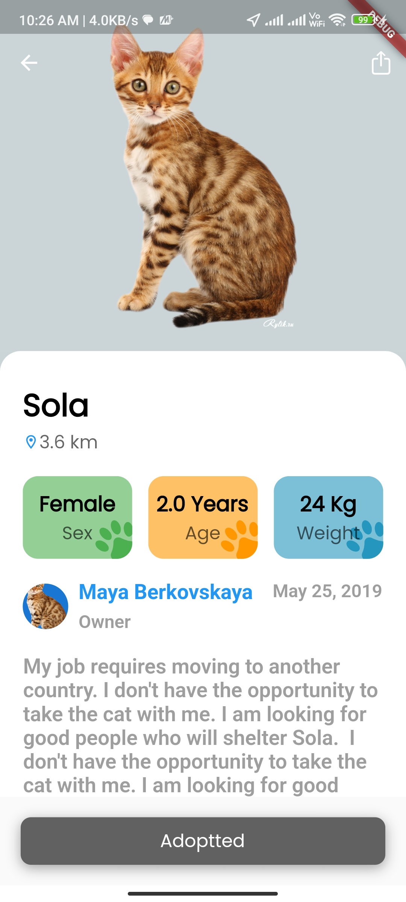

# Pet Adoption App

A Flutter app that allows users to browse and adopt pets. It includes an overview screen displaying a list of available pets and a details screen showing the information about each pet.

## Screenshots


<div style="display:flex;">
  
  
  
  
</div>

## Features

- View a list of available pets
- Tap on a pet to view its details
- Adopt a pet by adding it to your favorites

## Getting Started

Follow these instructions to get a local copy of the project up and running on your machine.

### Prerequisites

- Flutter SDK (version >= 2.0.0)
- Dart SDK (version >= 2.12.0)
- Android Studio / Xcode (for running on simulators / emulators)

### Installation

1. Clone the repository:

```shell
git clone https://github.com/your-username/pet_adoption_app.git
